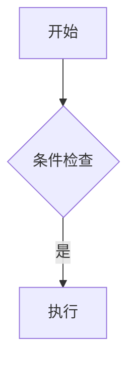
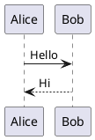

# Firefly 文章写作指南（POST 写作教程）

> 本文件是给作者看的「怎么写文章」速查手册，**放在 `docs/` 目录下，不会被博客系统加载为文章**。
> 真正发布到博客的文章请放在 `src/content/posts/`（`content.config.ts` 的 glob 只收录这个目录）。
> 所有示例语法均来自仓库自带示例文章（`src/content/posts/` 下），可直接复制使用。

---

## 0. 文件放哪

| 项目 | 说明 |
|---|---|
| 目录 | `src/content/posts/`（可建子目录，如 `guide/`、`draft/` 等） |
| 格式 | `.md`（标准 Markdown）或 `.mdx`（可写 JSX，见第 7 节） |
| 文件名 | 任意，建议 `YYYY-MM-DD-标题.md`；最终 URL 由 `slug` 决定 |
| 资源图 | 与文章同目录建 `images/`，用 `./images/xxx.avif` 引用；子目录文章用 `../images/xxx.avif` |

**目录式文章**：把文章放在 `子目录/index.md`（如 `guide/index.md`），URL 由 `slug` 决定，可写成带路径的形式 `slug: guide/firefly-wiki-link`，最终路径 `/posts/guide/firefly-wiki-link/`。`images/` 资源在子目录内用 `./images/`，跨出子目录用 `../images/`。

**其它内容类型（非文章，本指南不覆盖其写作语法）**：`src/content/dynamic/` 是「微动态 / 说说」，frontmatter 只有 `published` / `pinned` / `location`，正文为纯文本、无标题、不进文章列表；`src/content/spec/` 是 about / friends 等特殊页（schema 为空）。两者都不走文章集合，本指南只讲 `posts/`。

---

## 1. Frontmatter 字段

每篇文章开头用 `---` 包裹的 YAML 声明元信息：

```yaml
---
title: 文章标题
published: 2026-07-29          # 发布时间，必填；决定是否展示与排序
updated: 2026-07-29            # 更新时间（可选）
pinned: false                  # true 则置顶到文章列表顶部
draft: false                   # true 则为草稿，对普通读者隐藏
slug: my-post                  # 自定义 URL，默认用文件名；最终路径 /posts/<slug>/
description: 一句话摘要        # SEO 与列表卡片描述
tags: [Markdown, Firefly]      # 标签
category: 文章示例             # 分类
image: ./images/cover.avif     # 封面图：相对路径 / 以 / 开头的 public 路径 / http(s):// 网络图 / 字符串 api（自动取首图）
password: "123456"             # 设置后文章 AES-256-GCM 加密，需输入密码查看
passwordHint: "密码是123456"   # 加密文章的提示语
author: 非与                   # 作者（可选）
sourceLink: "https://..."      # 转载来源链接（可选）
licenseName: "CC BY 4.0"       # 许可名称（可选）
licenseUrl: "https://..."      # 许可链接（可选）
comment: true                  # 该篇文章是否开启评论（可选，默认跟随全局）
lang: zh-CN                    # 语言代码（可选）
---
```

> 提示：`published` 时间在未来会被当作定时发布；`draft: true` 的文章只在本地/构建残留，不会公开。

---

## 2. 标准 Markdown / GFM

支持常见语法：标题、引用、有序/无序列表、**任务列表**、围栏代码块、表格、链接（含**引用式链接**）、图片、行内代码、加粗/斜体、删除线 `~~文字~~`、分割线、自动链接、反斜杠转义、内联 HTML。

表格示例：

```md
| 左对齐 | 居中 | 右对齐 |
| :---   | :--: | ----: |
| aaa    | bbb  |   ccc |
```

**任务列表**（GFM）：

```md
- [ ] 待办事项
- [x] 已完成事项
```

**引用式链接 / 图片**（先定义再引用，正文更干净）：

```md
[Firefly][ref] 是个博客主题，配图见 [封面][img]。

[ref]: https://github.com/hefy2027/firefly
[img]: ./images/cover.avif
```

**分割线**：三个及以上 `---`、`***` 或 `___` 单独成行。

**更多标准语法**：硬换行（行末加两个空格或 `\` 产生 `<br>`）；链接 / 图片可带标题 `[文本](URL "标题")`、``；链接还能用空方括号 `[Google][]`（省略文本、以链接文本本身命名）；标题还支持 Setext 写法（下方 `=` 为 H1、`-` 为 H2）与行尾闭合 `#`；用 4 个空格或 1 个 Tab 缩进也能写代码块（无需围栏）。

---

## 3. Firefly 扩展 Markdown 语法

### 3.1 GitHub 仓库卡片 ⚠️ 易错点

用 **两冒号** 的 leaf 指令（不是三冒号！三冒号会被当成容器报 `Invalid directive`）：

```md
::github{repo="hefy2027/cf-manager"}
```

可并列多个：

```md
::github{repo="hefy2027/cf-manager"}
::github{repo="hefy2027/feedback-angel"}
```

### 3.2 提醒框 Admonition（GitHub 风格）

支持 **两种写法**，渲染效果一致：

- **写法 A：三冒号容器**（推荐、直观），类型：`note` / `tip` / `important` / `warning` / `caution`，示例见下方代码块。
- **写法 B：GitHub 引用式**（仓库示例多用），用 `> [!NOTE]` 引用块：

```md
> [!NOTE] NOTE
> 突出显示用户应该考虑的信息。

> [!TIP] 自定义标题
> 可选信息，帮助用户更成功。
```

```md
:::tip
这是一条提示。
:::

:::warning
这是一条警告。
:::
```

**主题与类型**：在 `src/config/siteConfig.ts` 的 `rehypeCallouts.theme` 切换为 `github` / `obsidian` / `vitepress` / `docusaurus`（改后需重启 dev）。各风格类型不同：

| 风格 | 基础类型 | 备注 |
|---|---|---|
| GitHub | `note` `tip` `important` `warning` `caution` | 也支持 `> [!NOTE]` 写法 |
| Obsidian | 最丰富：`abstract`/`summary`/`tldr` `info` `todo` `hint` `success`/`check`/`done` `question` `warning` `caution` `failure` `danger`/`error` `bug` `example` `quote` 等 | 类型名即 `> [!类型]` |
| VitePress | 同 GitHub 5 种 | 扁平现代风 |
| Docusaurus | `note` `tip` `info` `warning` `danger` | 容器用 **四冒号** `::::note`，可 `::::tip[自定义标题]` |

> 提醒：切换主题风格后需要**重启开发服务器**才会生效。

### 3.3 剧透（隐藏文字）

```md
答案其实是 :spoiler[被隐藏了 **哈哈**]！
```

### 3.4 图片画廊网格

`[grid]...[/grid]`，自动补齐高度、图注对齐，最多并排 4 张：

```md
[grid]


[/grid]
```

### 3.5 Wiki Link 双链（Obsidian 风格）

```md
[[slug]]              # 单独成段 → 渲染为文章链接卡片（含封面/描述/标签）
[[slug|显示别名]]     # 行内 → 普通链接并自定义标题（卡片场景也生效）
[[#本页标题]]         # 链接到本文某标题
```

**链接目标的三种写法**（填 slug 或文件路径，不带扩展名）：

| 写法 | 示例 | 说明 |
|---|---|---|
| frontmatter 的 `slug` | `[[firefly]]` | Firefly 概念；Obsidian 里不可点 |
| 文件路径（相对仓库根 `src/content/posts`） | `[[guide/firefly-layout-system]]` | 推荐，与 Obsidian 路径一致 |
| 裸文件名（仓库内唯一时） | `[[firefly-layout-system]]` | 默认写法，无需改设置 |

**跨文章锚点**：在 slug 后加 `#标题`，始终渲染为普通链接：

```md
[[code-examples#语法高亮|查看代码块语法高亮]]
```

> ⚠️ **附件嵌入不支持**：`![[image.png]]` 这类语法不会被转换，会按原文显示；行内代码/代码块里的 `[[...]]` 也不会转换。

### 3.6 Emoji

可直接输入，或使用短代码 `:smile:`。

---

## 4. 数学与图表

### 4.1 KaTeX 数学公式

```md
行内公式 $e^{i\pi} + 1 = 0$ 很美。

$$
\int_{-\infty}^{\infty} e^{-x^2}\,dx = \sqrt{\pi}
$$
```

化学方程式：`$\ce{H2O}$`。

> 支持 KaTeX 全部命令（矩阵 `pmatrix`、对齐 `aligned`、极限 `lim`、求和 `\sum`、化学式 `\ce` 等），详见 [KaTeX 支持函数表](https://katex.org/docs/supported.html)。

### 4.2 Mermaid 图表

````md

````

支持流程图、时序图、ER 图、类图、状态图、饼图、甘特图、思维导图、用户旅程图、时间线、Git 图、看板、XY 图、Sankey 图等（构建期生成亮/暗两套 SVG）。

### 4.3 PlantUML 图表

````md

````

构建期生成 SVG，亮暗主题自动切换，支持缩放/拖拽/全屏。

支持全部 PlantUML 图类型：时序图、类图、用例图、活动图、状态图、组件图、部署图、ER 图、C4 图（`!includeurl` 引入标准库）等，只要写在 `@startuml` / `@enduml` 之间即可。

---

## 5. 代码块增强（Expressive Code）

基础围栏代码块已带语法高亮。可用「语言后花括号」做行标记：

````md
```js {1, 4, 7-8}
// 高亮第 1、4、7-8 行
const a = 1;
```
````

常用修饰：

| 写法 | 作用 |
|---|---|
| `{1, 4, 7-8}` | 高亮指定行 |
| `mark` / `ins` / `del` | 标记 / 插入 / 删除样式 |
| `title="app.js"` | 代码块标题栏 |
| `frame="none"` / `frame="code"` | 去掉/保留编辑器外框 |
| `wrap` / `wrap=false` | 自动换行 |
| `preserveIndent` / `preserveIndent=false` | 换行时保留（默认）或取消缩进 |
| `collapse={1-5}` | 可折叠代码段 |
| `showLineNumbers` / `startLineNumber=10` | 行号 / 起始行号 |
| `/regex/` | 正则标记匹配文本 |
| `"某段文字"` | 行内文本标记：高亮代码里出现的该字符串（比正则轻量） |
| `ins="文本"` / `del="文本"` | 行内文本标记设为插入（绿）/ 删除（红）样式 |

**自动终端框架**：用 `bash` / `sh` / `ps` / `powershell` 等 shell 语言时，代码块会自动套上终端风格外框；用 `frame="none"` 可关闭。

**Tab 代码组**（VitePress 风格）：

````md
:::: code-group labels=[code.js, code.py]

```js
export function greet(name) { return `Hello, ${name}!`; }
```

```py
def greet(name): return f"Hello, {name}!"
```

::::
````

---

**ANSI 彩色终端输出**：用 `ansi` 语言块渲染终端转义色（日志、CLI 输出高亮）：

````md
```ansi
[31mRed[0m [32mGreen[0m [1mBold[0m
```
````

**Diff 语法**：用 `diff` 语言块，`+` 行标绿（插入）、`-` 行标红（删除）；可叠加其他语言高亮（如 ` ```diff lang="js" `）：

````md
```diff
+此行将标记为已插入
-此行将标记为已删除
```

```diff lang="js"
- console.log('旧代码')
+ console.log('新代码')
```
````

**行标记加标签**：`{"行号": "标签"}` 写长说明，`ins`/`del` 决定颜色：

````md
```js {"1. 提供 value prop:":5-6} del={"2. 移除状态:":8-10} ins={"3. 渲染 children:":12-15}
// 你的代码
```
````

**Tab 代码组进阶**（语法同 VitePress）：
- 标签支持 emoji 短代码：`labels=[:package: npm, :package: pnpm, :yarn: yarn]`
- 组内可放**任意内容**（文字、列表、图片），不限于代码块
- 组内代码块仍可叠加标题、行号、行标记、折叠、终端框架

> 注意：`:::` 与 `code-group` 之间的空格不能省略；`labels=[...]` 按顺序对应组内代码块。

---

## 6. 媒体

**图片**：``；子目录文章用 `../images/x.avif`。

**视频**（YouTube / Bilibili）：直接用内联 HTML 粘贴 `<iframe>`：

```html
<!-- YouTube -->
<iframe width="100%" height="468"
  src="https://www.youtube.com/embed/VIDEO_ID"
  frameborder="0" allowfullscreen></iframe>

<!-- Bilibili（协议相对地址） -->
<iframe width="100%" height="468"
  src="//player.bilibili.com/player.html?bvid=BV1xx411c7mD"
  scrolling="no" frameborder="no" allowfullscreen></iframe>
```

---

## 7. MDX（写 JSX）

把文件后缀改为 `.mdx` 即可在 Markdown 里写 JSX、导入组件、用 JS 表达式：

```mdx
---
title: MDX 示例
published: 2026-07-29
---

import { Icon } from 'astro-icon/components'

export const year = new Date().getFullYear()

今年是 {year} 年。<Icon name="fa6-solid:fish" />
```

> 在 `.mdx` 里可写任意 JSX/HTML，也能直接用 Tailwind 类名加样式（如 `<div className="text-center text-xl">…</div>`）；组件需先 `import` 再使用。

---

## 8. 文章加密

在 Frontmatter 设置密码即可（构建期 AES-256-GCM 加密，客户端 Web Crypto 解密，会话内缓存）：

```yaml
password: "123456"
passwordHint: "示例文章密码123456"
```

---

## 9. 最小可用模板

复制下面这段，改成你自己的内容即可发布：

```md
---
title: 我的第一篇文章
published: 2026-07-29
description: 这是用 Firefly 写的第一篇博客。
tags: [随笔]
category: 生活
slug: my-first-post
image: api
---

正文写在这里。支持 **加粗**、`行内代码`、[链接](https://hefy2027.github.io)。

:::tip
试试扩展语法。
:::

::github{repo="hefy2027/cf-manager"}
```

---

## 10. 站点布局系统（配置参考，非文章语法）

仓库示例 `guide/firefly-layout-system.md` 讲解的是**站点级布局**（不是写在文章里的语法），对应 `src/config` 里的配置：

- **侧边栏布局**（`sidebarConfig.ts` 的 `sidebarLayoutConfig`）：
  - `position: "left" | "right" | "both"` —— 左 / 右 / 双侧边栏
  - `showBothSidebarsOnPostPage: true` —— 文章详情页额外显示双侧边栏
  - `enable: true` —— 是否启用侧边栏；窄屏（<1280px）由 `tabletSidebar` 决定显示单侧栏并隐藏另一个
- **文章列表布局**（`siteConfig.ts` 的 `postListLayout`）：
  - `defaultMode: "list" | "grid"` —— 列表 / 网格
  - `grid.masonry: true` —— 网格瀑布流
  - `grid.columnWidth` —— 卡片最小宽度(px)，浏览器自动算列数
  - `allowSwitch: true` —— 允许访客切换列表/网格

改这些配置后需**重启 dev**。响应式：超小屏列表自动转网格、窄屏双侧栏转单侧栏。

---

## 附：常用功能一句话索引

- 置顶 → `pinned: true`
- 草稿/隐藏 → `draft: true`
- 自定义链接 → `slug: xxx`
- 加密 → `password` + `passwordHint`
- 仓库卡片 → `::github{repo="owner/repo"}`（两冒号！）
- 提示框 → `:::tip` / `:::warning` …
- 双链 → `[[slug]]` / `[[slug|别名]]`
- 公式 → `$...$` / `$$...$$`
- 流程图 → ` ```mermaid `
- 代码组 → `:::: code-group labels=[...] `
- 视频 → 粘 `<iframe>`
- JSX → 用 `.mdx`
