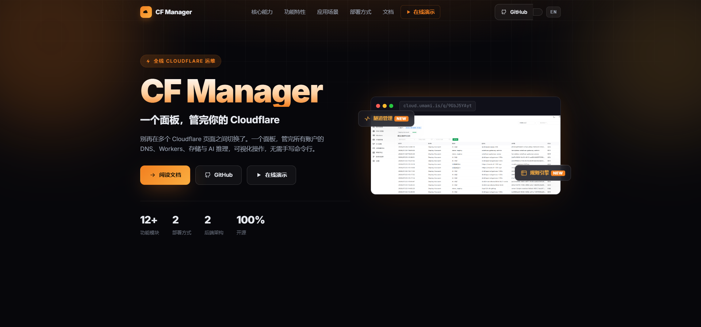
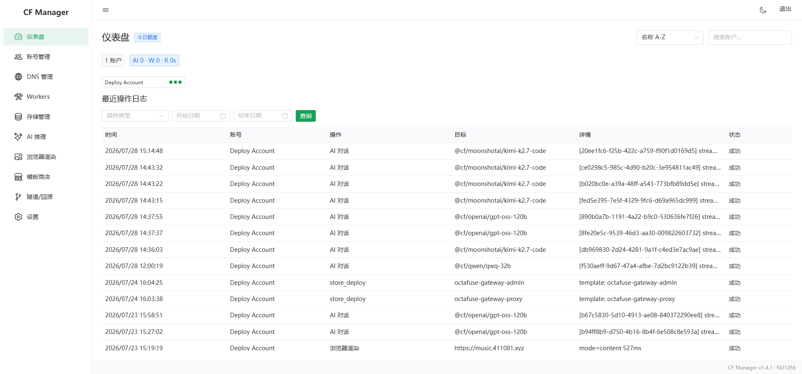
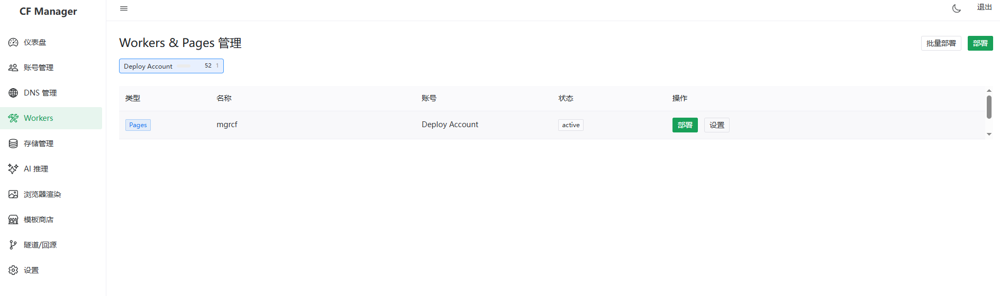
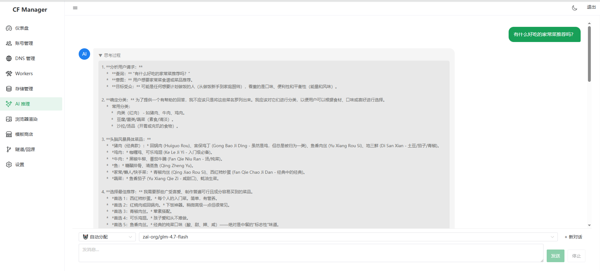
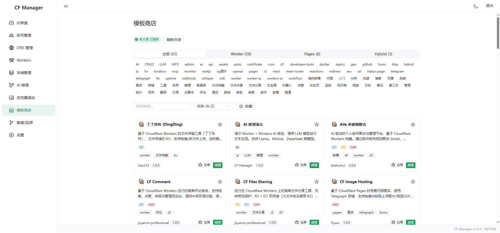

## 你是不是也这样？

- 三个 Cloudflare 账户，一个放博客，一个跑 Workers AI，还有一个挂了十几条 DNS……
- 查个配额要来回切号，部署个 Worker 要手动点到手酸
- 想用 Workers AI 玩点东西，API 调了半天还不知道烧了多少 token

就是下面这个——[CF Manager](https://cf-manager.surge.sh/)。**一个面板，管完你的 Cloudflare。** 12+ 功能模块，2 种部署方式，2 套后端架构，100% 开源。



> 在线演示：https://mgrcf.pages.dev/admin/（密码 `cfmgrbest`）｜落地页：[cf-manager.surge.sh](https://cf-manager.surge.sh/)

---

## 一张图看懂它是什么

简单说：**把 Cloudflare 官方后台分散在多个页面、多个账户的功能，全收到一个面板里。**



左边菜单就是你能管的所有东西——Workers、DNS、存储、AI 推理、隧道、规则引擎……不管你有几个 Cloudflare 账户，登录后一键切换，数据在你自己的服务器上加密存储。

---

## 一个平台，三大核心能力

### 多账户统一管理

API Token / Global API Key **双认证**，凭证 **AES 加密存储**。多账户一键切换、统一调度，操作审计日志跟着账户走，再也不用每次查配额都重新登录。

### 全栈资源运维

可视化管理 DNS、Workers / Pages、KV / D1 / R2 存储、Tunnel 隧道与规则引擎。跨账户批量部署，**结构化表单替代手写 JSON**，不用背命令行。



### OpenAI 兼容 AI 网关

Workers AI **全模型推理**，Prompt Caching **感知计费**，多账户**配额自动调度**。并暴露 `/v1/chat/completions` 和 `/v1/models` 端点——你本地的 ChatBox、OpenCat、Continue 可以直接连上来，跟用 OpenAI API 一样。



---

## 覆盖 Cloudflare 运维全链路

从域名 DNS 到边缘计算，从对象存储到 AI 推理，**12 大模块一站式管理**：

| 模块 | 能做什么 |
|------|----------|
| 实时仪表盘 | 各账户 Workers、AI、渲染配额实时展示，操作审计一目了然 |
| DNS 管理 | A / AAAA / CNAME / MX / TXT 全记录，一键代理开关，批量操作 |
| Workers / Pages | 脚本与项目 CRUD，单/跨账户批量部署，绑定、环境变量、路由、自定义域名 |
| 隧道管理 **NEW** | Tunnel 创建/删除，Ingress 可视化编辑，一键回源向导自动配置 DNS + ingress |
| 规则引擎 **NEW** | 8 种规则类型（回源/重写/头转换/缓存/防火墙/限速/重定向），结构化表单 + 表达式 |
| AI 推理 | Workers AI 全模型，流式对话 + Reasoning 可视化，多账户智能调度 |
| 浏览器渲染 | 截图 / HTML / Markdown / PDF / 链接提取，5 种模式，SSRF 防护 |
| 存储管理 | KV 键值 CRUD、D1 SQL 查询、R2 文件上传/下载/预览 |
| 应用商店 | 内置 65+ 模板，支持第三方源扩展，一键部署 Workers / Pages |
| OpenAI 兼容 API | `/v1/chat/completions`、`/v1/models`，流式 + 非流式，仅限本地调试 |
| 安全特性 | API Token AES 加密，可选登录密码，`/admin/` 路径隐藏，完整审计日志 |
| 双后端架构 | Docker（Express + SQLite）与 Cloudflare Pages（Hono + D1），同一套逻辑按需选 |



---

## 谁在用？

**个人开发者** — 把多个 Cloudflare 账户汇总到一个面板，本地调试 AI 推理与浏览器渲染，OpenAI 兼容接口接入自己的工具链。

**团队运维** — 统一管理团队域名、Workers、DNS 与存储，跨账户批量部署，配额与用量集中可视。

**回源与组网** — 一键回源向导自动打通 Tunnel + DNS CNAME，可视化编辑 Ingress，零命令行。

**自托管私有部署** — Docker Compose 一键自建，HTTP/SOCKS5 代理支持，凭证加密不外泄，数据完全自控。

---

## 5 分钟，零成本部署

最快的方式：**Fork 仓库 → 配置 4 个 Secrets → 点一下运行**，全程浏览器操作。

| 步骤 | 操作 |
|------|------|
| 1 | 打开 [GitHub 仓库](https://github.com/hefy2027/cf-manager)，点右上角 **Fork** |
| 2 | 你的 Fork → **Settings** → **Environments** → 创建 `production`，添加 4 个 Secrets |
| 3 | **Actions** → **Deploy to Cloudflare Pages (Secrets)** → Run，环境名填 `production` |
| 4 | 部署完访问 `https://cfmgr.pages.dev/admin/`，输入 `API_SECRET`，搞定 |

| 变量 | 怎么填 |
|------|--------|
| `CF_API_KEY` | Cloudflare Global API Key |
| `CF_EMAIL` | Cloudflare 账户邮箱 |
| `ENCRYPTION_KEY` | 至少 16 位随机字符串 |
| `API_SECRET` | 登录面板的密码 |

> 推荐用 API Token 替代 Global API Key，具体权限见[附录](#附录api-token-权限配置对照)。

也可以用 Docker 自托管：

```bash
git clone https://github.com/hefy2027/cf-manager.git
cd cf-manager && cp .env.example .env
chmod +x deploy.sh && ./deploy.sh
# → http://localhost:3000/admin/
```

---

## 技术栈

| 前端 | 后端（Docker） | 后端（Cloudflare Pages） | 部署 |
|------|---------------|------------------------|------|
| Vue 3 + Naive UI + Pinia | Express 5 + SQLite | Hono + D1 | Docker Compose / Cloudflare Pages |

---

## 最后说两句

如果你也被多账户切换折磨过，Fork 一个试试，几分钟的事。

项目 MIT 开源，当前 v1.4.1。

- GitHub 仓库（主）：https://github.com/hefy2027/cf-manager
- Gitee 镜像：https://gitee.com/hefy27/cf-manager
- 落地页：https://cf-manager.surge.sh/
- 模板市场：https://github.com/hefy2027/cf-store

---

## 附录：API Token 权限配置对照

使用 API Token 时，创建自定义 Token 需要勾选以下 14 项权限：

| # | 权限 | 级别 | 对应功能 |
|---|------|------|----------|
| 1 | `User Details:Read` | User | 验证 Token 有效性 |
| 2 | `Account Analytics:Read` | Account | 仪表盘用量统计 |
| 3 | `Workers Scripts:Edit` | Account | Workers 脚本 / Secrets / Cron / 域名 / 设置 |
| 4 | `Workers Tail:Read` | Account | Worker 日志查看 |
| 5 | `Workers KV Storage:Edit` | Account | KV 命名空间和键值管理 |
| 6 | `D1:Edit` | Account | D1 数据库管理及 SQL 查询 |
| 7 | `Workers R2 Storage:Edit` | Account | R2 存储桶和对象管理 |
| 8 | `Cloudflare Pages:Edit` | Account | Pages 项目和部署管理 |
| 9 | `Workers AI:Edit` | Account | AI 模型列表和推理 |
| 10 | `Browser Rendering:Edit` | Account | 浏览器渲染（5 种模式） |
| 11 | `Cloudflare Tunnel:Edit` | Account | Tunnel 管理 |
| 12 | `Zone:Read` | Zone | 区域列表读取 |
| 13 | `DNS:Edit` | Zone | DNS 记录管理 |
| 14 | `Workers Routes:Edit` | Zone | Workers 路由管理 |

**资源范围**：Account Resources → `All accounts`，Zone Resources → `All zones`。

**创建入口**：[Cloudflare API Tokens](https://dash.cloudflare.com/profile/api-tokens) → 创建令牌 → 自定义。TTL 建议 `Forever`，生成后**立即复制保存**。
