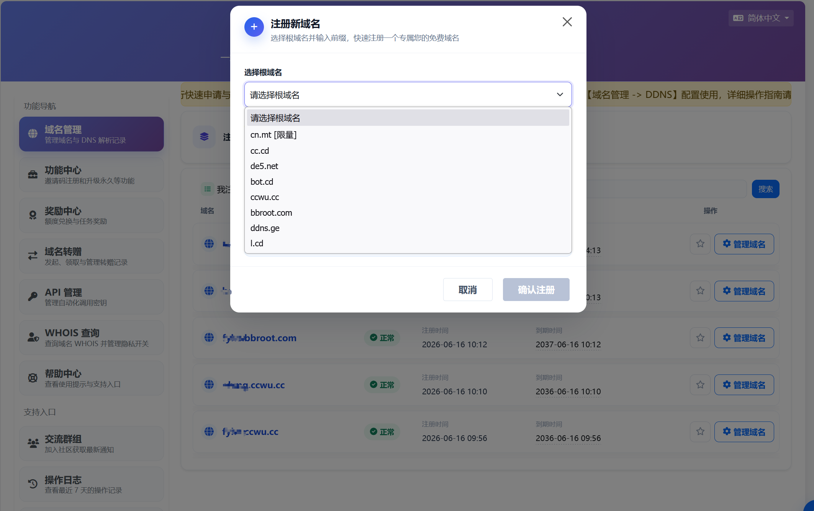
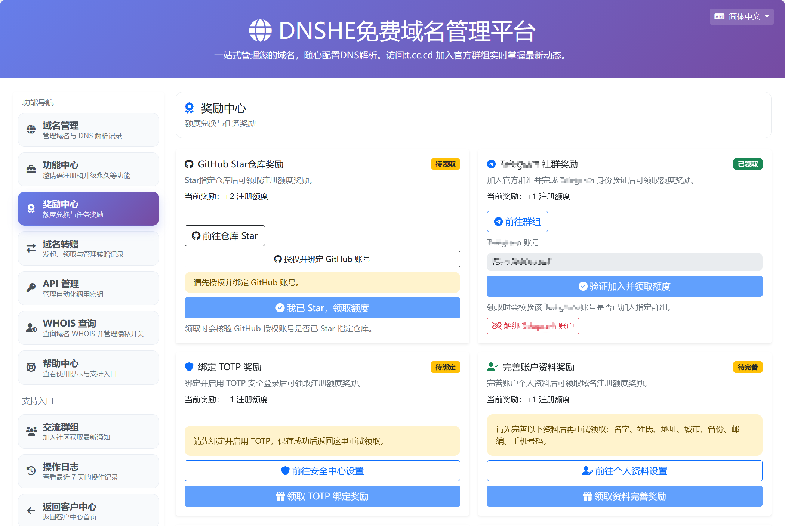
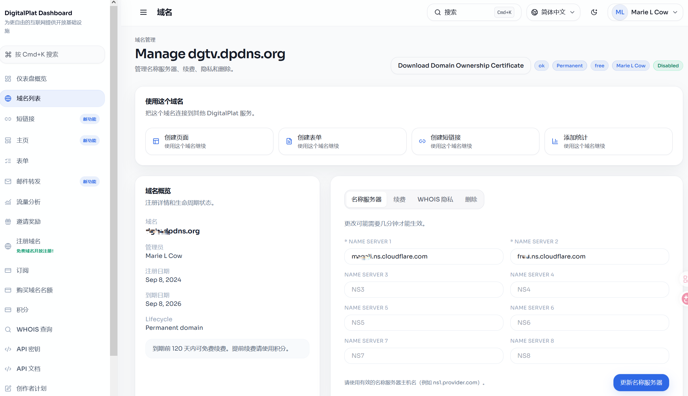
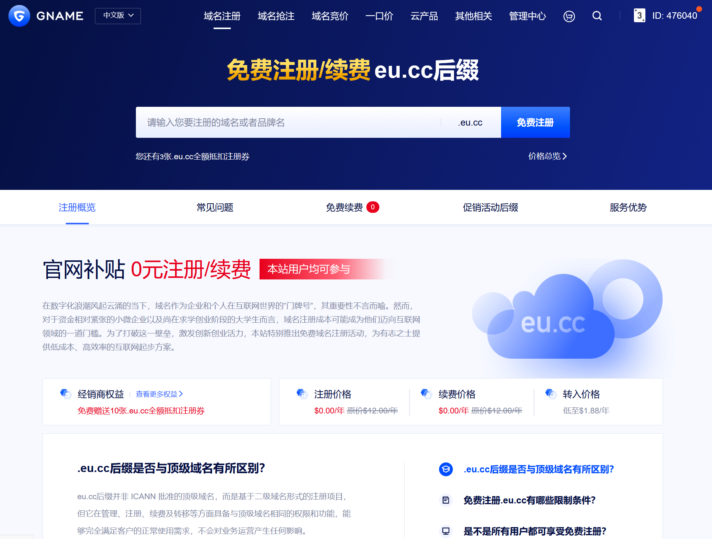
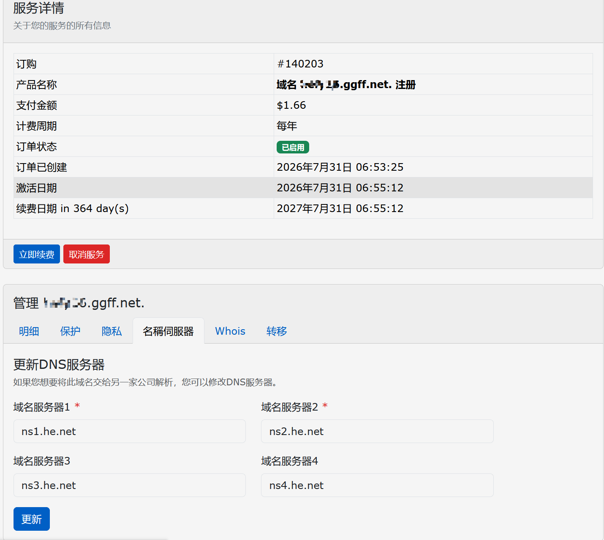
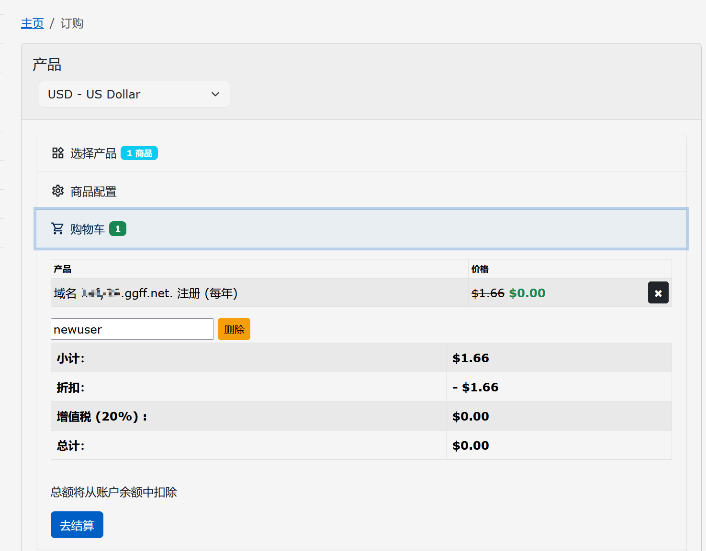

上周三晚上，朋友突然甩过来一个需求：帮忙搭个临时小站，越快越好。我习惯性打开 Freenom 想薅个 .tk——哦对，忘了，它已经凉透了。

Meta 一告、ICANN 一封，曾经人手一个的免费域名说没就没。这两年我陆陆续续试了不少平替，跑路的跑路、注册不了的注册不了，大浪淘沙下来，现在还在稳定用的就四个：**DnShe、DigitalPlat、Gname、L53**。

今天挨个说，优缺点都摆出来。

## DnShe：量大管饱，最近的主力

这个是我最近用得最多的。

后缀给得很大方，控制台里六七个后缀随便挑，`de5.net`、`cc.cd`、`us.ci` 这些都在，新后缀也时不时会上。大部分后缀支持托管到 Cloudflare，生效速度也是真快——刚绑定完基本就通了，不用像某些平台那样干等半天。

先说额度。现在不要邀请码了，注册完是基础名额，想加额度就去控制台的"奖励中心"做任务：Star 它家 GitHub 仓库 +2、加官方交流群 +1、绑定 TOTP 两步验证 +1、完善个人资料 +1、分享到 X +1。社群那个任务领完还弹了句"已奖励 1 个注册额度"，亲测秒到账。注册入口：https://my.dnshe.com/go.php?code=paZCgG53Jk

续期这块，2026 年 1 月 1 日起新注册的域名改成按年算了，到期前 180 天内会开免费续期通道，面板点一下就行，怕忘的话也能走 API 一键续。

## DigitalPlat（US.kg）：老牌选手，但国内别抱期待

这个我 24 年中旬就注册了，算看着它一路折腾过来的。

它前身是 US.KG，当年也是免费域名圈的名人。后来滥用的人太多，直接被注册局暂停解析，平台没办法，把主力换成了 DPDNS.ORG，早注册的那批 US.KG 子域名也被自动迁了过去。

你可能想不到，这一刀切下去反而是好事。以前 US.KG 三天两头炸，换成 DPDNS.ORG 之后，至少我没再听说大范围抽风的事。

现在真免费的后缀是 `dpdns.org` 和 `qd.je` 两个；`qzz.io` 最近改成了一次性 3 美元的付费注册（续期仍免费）；`us.kg` 和 `xx.kg` 因为 .KG 注册局对滥用零容忍，暂时暂停注册，老域名不受影响。都支持托管 Cloudflare。注册要过 GitHub 认证，账号得有点年头和活跃度，空号新号大概率过不去。

额度抠了点：默认免费 1 个，给它 GitHub 项目点个赞再送 1 个，撑死 2 个。续期是有效期 360 天，到期前 120 天内免费续。

控制台地址：https://dash.domain.digitalplat.org

但丑话说在前头：它家后缀在国内大部分地区都不太好用，访问慢、偶尔抽风。我自己挂个 Workers、跑个自用 API 还行，想正经给国内访客用就算了。总体评价：一般。

## Gname：门槛最低，不用手机号

Gname 本身是个正经域名注册商，免费域名是它搞的拉新活动，注册、续费都免费（官方公告说的，我先信着）。它家有好几个域名，`.com` 走国内，`.vip` 是国际站，活动入口在 `gname.vip`。

最大亮点是注册门槛：邮箱验证 + MFA 就行，我用的是谷歌身份验证器（Authenticator），**全程不用绑手机号**。对手机号过敏的朋友（比如我）会很舒服。

活动后缀是 `eu.cc`。玩法是去活动页点"免费注册"，系统发全额抵扣券到账户，下单时用券直接 0 元结账。普通用户限 3 个，认证代理商最多能到 20 个。注意券领了之后 30 天内要用掉，过期不退；两字符、三字符这类短位和品牌词属于溢价名，不能用券。

续期是几家里最麻烦的：必须在到期前 90 天内，去活动页面的"免费续费"列表**手动**点续费。注意，自动续费不免费，别偷懒，设个日历提醒吧。

活动直达：https://www.gname.vip/tld-eu-cc.html

## L53：冷门但省心，新人首年免费

这个知道的人不多，是个做三级域名的小站，域名后缀是 `ggff.net` 和 `filegear-sg.me` 这类，比较小众，但也正因为小众，暂时没经历过大规模的滥用和封杀。

它的玩法很直接：新用户注册下单时填优惠码 `newuser`，一个域名首年直接免费。没有邀请码那套人情世故，也不用给 GitHub 点星，注册完就能用。

下单时把 `newuser` 填进优惠码那一栏，价格直接归零：

要说缺点，就是可选后缀少、名字也不如别家好听，`filegear-sg.me` 这种长度念着都费劲。而且平台体量小，能撑多久是个未知数——不过免费域名本来就这德性，能用一天是一天。

注册地址：https://customer.l53.net/

## 一张表看完

| 平台 | 后缀 | CF 托管 | 额度 | 国内体验 | 续期 |
|------|------|:---:|------|------|------|
| DnShe | de5.net 等 6 个 | ✅（cn.mt、bbroot.com 除外） | 基础 + 任务奖励 | 还行 | 到期前 180 天内一键续 |
| DigitalPlat | dpdns.org、qd.je | ✅ | 1+1，共 2 个 | 一般 | 360 天有效，前 120 天可续 |
| Gname | eu.cc | ✅ | 3 个（代理最多 20 个） | 一般 | 到期前 90 天内手动续 |
| L53 | ggff.net、filegear-sg.me | ✅ | 1 个（newuser 优惠码） | 一般 | 首年免费，到期续费 |

## 最后说两句大实话

我现在的分工：主力折腾用 DnShe，海外向的小东西挂 DigitalPlat，Gname 留给不想留手机号的场景，L53 当备胎随手养着。

免费域名这东西，说收回就收回，说改规则就改规则，Freenom 就是前车之鉴。拿来折腾、做实验、挂 Workers，随便玩；正经项目还是花几块钱买个域名踏实——.xyz 首年也就几块钱的事儿。

别到时候站做起来了，域名没了，那就真欲哭无泪了。

你手上还有在用的免费域名吗？评论区报个到，踩过坑的也欢迎吐槽。觉得有用的话点个"在看"，我们下篇见。
