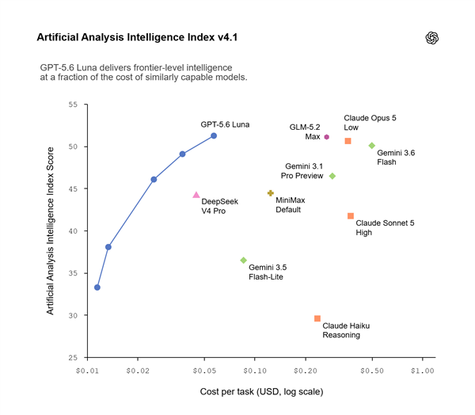
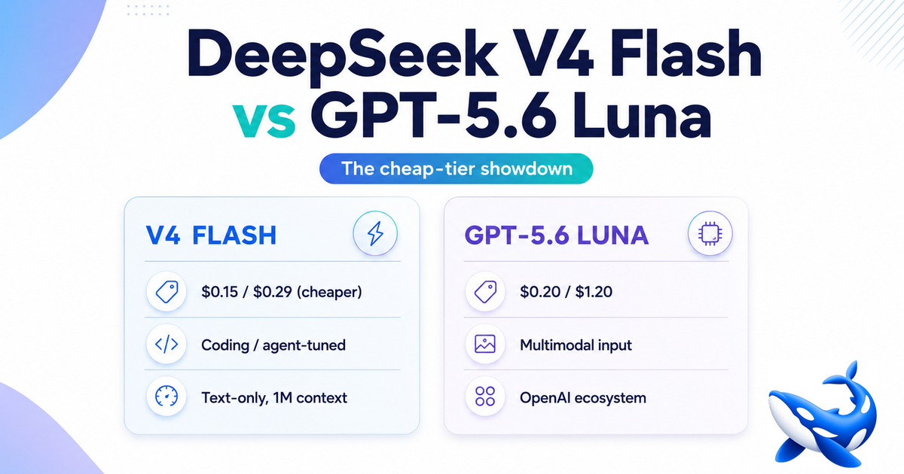

昨天，7 月 31 号，AI 圈子跟商量好了似的。

凌晨 OpenAI 宣布 GPT-5.6 大降价，Luna 打两折。下午 DeepSeek 甩出 V4-Flash 正式版，DeepSWE 涨 7.5 倍，冲上知乎热搜第一。

---

## OpenAI：降价 + 自进化

| 模型 | 原价（输入/输出，$/M Token） | 新价 | 变化 |
|------|------|------|------|
| Luna | 1 / 6 | 0.20 / 1.20 | **-80%** |
| Terra | 2.50 / 15 | 2 / 12 | -20% |
| Sol | 5 / 30 | 不变 | +Fast 模式（2.5x 速，2x 价） |

Luna 输入降到 $0.20——跟白送差不多了。OpenAI 还专门贴了一张 Artificial Analysis 的图，宣称降价后性价比反超 DeepSeek V4 Pro。

但价格降得这么狠，不是因为 OpenAI 良心发现。前一天他们披露了一个细节：**GPT-5.6 Sol 已经在优化自己的底层基础设施了**——重写 GPU 内核（成本 -20%）、迭代推测解码模型（吞吐 +15%）、自动调优负载均衡和 KV Cache。省下来的钱变成了降价。

OpenAI 管这整套流程叫 **RSI（递归自我改进）**。一个闭环：模型越强 → 越能优化自己 → 成本越低 → 降价 → 更多人用 → 模型更强。

另一件事：安全负责人翁荔（Lilian Weng）被曝回归 OpenAI。

---

## DeepSeek：不降价，升 Agent 能力

V4-Flash 正式版 API 上线公测。模型结构、参数（284B/13B MoE）完全没变，纯靠**后训练重做**把能力拉上去的。

| 基准测试 | V4-Flash Preview | V4-Pro Preview | V4-Flash 正式 | Claude Opus 4.8 |
|---|:---:|:---:|:---:|:---:|
| Terminal-Bench 2.1 | 61.8 | 72.1 | **82.7** | 85.0 |
| NL2Repo | 39.4 | 38.5 | **54.2** | 69.7 |
| DeepSWE | 7.3 | 12.8 | **54.4** | 58.0 |
| Cybergym | 38.7 | 52.7 | **76.7** | 83.1 |
| Toolathlon | 49.7 | 55.9 | **70.3** | 76.2 |

DeepSWE 涨 7.5 倍，从玩具变工具。Terminal-Bench 82.7，逼近 Opus 的 85——而且这是 Flash 版，定位是轻量低成本。

价格：输入 ¥1/M，输出 ¥2/M，缓存 ¥0.02/M。1M 上下文，MIT 开源。

---

## 两张表看结论

| | Luna | Terra | Sol | V4-Flash |
|---|---|---|---|---|
| 输出价格 ($/M) | 1.20 | 12.00 | 30.00 | **0.28** |
| 上下文 | 128K | 128K | 256K | **1M** |
| 多模态 | ✅ | ✅ | ✅ | ❌ |
| 思考模式 | ❌ | ❌ | ✅ | ✅ |
| 开源 | ❌ | ❌ | ❌ | ✅ |

三条事实：

1. **论便宜，DeepSeek 没对手。** 输出成本只有 Luna 的 1/4。输出密集型任务，Flash 碾压。
2. **多模态是 OpenAI 的护城河。** 需要处理图片、截图、PDF？只能 OpenAI。
3. **上下文窗口 DeepSeek 翻倍。** 1M vs 256K，长文档场景差距明显。

但能力对比要看场景。这波 benchmark 暴涨集中在 **Agent 类任务**——让 AI 自己操作终端、改代码、调工具链。如果你的日常需求是写作、翻译、问答，这些分数的实际体感差距没那么大。

我的选型逻辑很简单：**日常对话用 OpenAI（多模态刚需），写代码和跑 Agent 用 DeepSeek（便宜且专精）。** 两个一起用，没毛病。

---

## 最后

两件事同一天发生不是巧合。OpenAI 在打价格战抢用户，DeepSeek 在走性价比路线——不降价但让你觉得"这价格买到这能力，真值"。

真正有意思的是 GPT-5.6 的自进化闭环。AI 开始帮自己写优化代码了，省下来的成本变成降价。这个模式一旦跑稳，后面变化会多快，没人知道。

你现在的 AI 主力模型是哪个？

*（本文数据与图片来源，截至 2026/7/31）*

**GPT-5.6 降价与 RSI 自进化：**
- [OpenAI 官方公告（财新报道）](https://www.caixin.com/2026-07-31/102469998.html)
- [GPT-5.6 RSI 自优化飞轮技术细节（SegmentFault）](https://segmentfault.com/a/1190000048100116)
- [OpenAI 自进化秘籍 + 翁荔回归（智东西）](https://zhidx.com/p/580732.html)
- [降价前后价格确认（arte.itlibra）](https://arte.itlibra.com/zh/articles/gpt-5-6-release-features-benchmarks-pricing)

**DeepSeek V4-Flash 正式版：**
- [官方 API 文档发布日志（转载）](https://lininn.cn/page/deepseek-v4-flash-0731-official-2026)
- [9 项 Agent 基准详细数据（AI工具宝箱）](https://www.aitoollab.cn/articles/deepseek-v4-flash-agent-open-source-2026/)
- [DeepSeek 官方公告（财联社）](https://finance.sina.com.cn/wm/2026-07-31/doc-inikstfm1226010.shtml)

**价格 / 能力对比：**
- [DeepSeek V4 Flash vs GPT-5.6 Luna（OrcaRouter）](https://www.orcarouter.ai/zh-CN/blog/deepseek-v4-flash-vs-gpt-5-6-luna)

**图中配图来源：**
- Artificial Analysis Intelligence Index v4.1（新浪科技转载）
- OrcaRouter 多维度对比图
