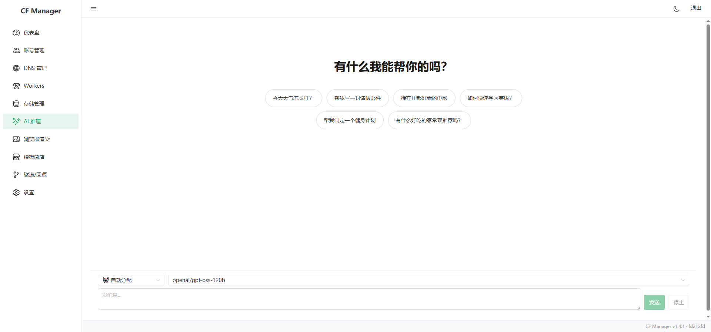

## 你是不是也这样？

- 三个 Cloudflare 账户，一个放博客，一个跑 Workers AI，还有一个挂了十几条 DNS……
- 查个配额要来回切号，部署个 Worker 要手动点到手酸
- 想用 Workers AI 玩点东西，API 调了半天还不知道烧了多少 token

**我忍了两年，最后给自己写了一个面板。**

就是下面这个——[CF Manager](https://cf-manager.surge.sh/)，一个管完所有 Cloudflare 账户的开源面板。


> 在线演示：https://mgrcf.pages.dev/admin/（密码 `cfmgrbest`）｜落地页：[cf-manager.surge.sh](https://cf-manager.surge.sh/)

---

## 一张图看懂它是什么

简单说：**把 Cloudflare 官方后台分散在多个页面、多个账户的功能，全收到一个面板里。**


左边菜单就是你能管的所有东西——Workers、DNS、存储、AI 推理、隧道、规则引擎……不管你有几个 Cloudflare 账户，登录后一键切换，数据在你自己的服务器上加密存储。

---

## 为什么值得试试？

**1. 不用再切号了**

API Token / Global API Key 双认证，凭证 AES 加密。多个账户添加进来之后，左上角随便切，操作日志跟着账户走。

**2. 批量操作才是正经事**

在官方后台给 10 个域名加 CNAME 是什么体验，你应该懂。CF Manager 里跨账户批量的 Workers 部署、DNS 记录修改，一次搞定。

**3. AI 推理终于不瞎了**

Workers AI 全模型对话，每次请求的 token 消耗、缓存命中、费用估算实时显示在右侧——不用再盯着 API 返回值自己算。



**4. 内置 65+ 模板，点一下就部署**

不想从零写 Worker？模板商店挑一个——短链、图床、临时邮箱、状态监控、AI 聊天机器人……点「部署」就上线，源码也在你账户里。


**5. 给开发者留了 OpenAI 兼容接口**

CF Manager 暴露了一个 `/v1/chat/completions` 端点。什么意思？你本地的 ChatBox、OpenCat、Continue 可以直接连上来，拿 Workers AI 当后端，跟用 OpenAI API 一样丝滑。

| 对比 | Cloudflare 官方后台 | CF Manager |
|------|-------------------|------------|
| 多账户 | 每个账户独立登录 | 一个面板全切 |
| 批量部署 | 逐个操作 | 跨账户批量 |
| AI 费用 | 自己算 | 实时显示 |
| 模板市场 | 没有 | 65+ 一键部署 |
| OpenAI 兼容 | 没有 | 内置 /v1 接口 |

---

## 5 分钟，零成本部署

最快的方式：**Fork 仓库 → 配置 4 个 Secrets → 点一下运行**，全程浏览器操作，不装任何工具。

**第一步**：打开 [GitHub 仓库](https://github.com/hefy2027/cf-manager)，点右上角 **Fork**。

**第二步**：进入你的 Fork → **Settings** → **Environments** → **New environment**，创建环境名 `production`，添加 4 个 Secrets：

| 变量 | 怎么填 |
|------|--------|
| `CF_API_KEY` | 你的 Cloudflare Global API Key |
| `CF_EMAIL` | Cloudflare 账户邮箱 |
| `ENCRYPTION_KEY` | 随便填一串至少 16 位的随机字符 |
| `API_SECRET` | 登录面板的密码 |

> 推荐用 API Token 而非 Global API Key，具体勾选哪些权限见[附录](#附录api-token-权限配置对照)。

**第三步**：**Actions** → **Deploy to Cloudflare Pages (Secrets)** → **Run workflow**，环境名填 `production`。

等几分钟，访问 `https://cfmgr.pages.dev/admin/`，输入 `API_SECRET`，搞定。

---

## 进去之后做什么？

### 1. 添加账户

「账户管理」→「添加账户」，输入 API Token 和邮箱，**凭证会 AES 加密存储**，不是你裸奔的 Key。

### 2. 看仪表盘

实时看到每个账户的 Workers 配额、AI 用量、渲染额度——再也不用点进每个后台手动查。

### 3. 管 Workers


部署、设置 Secrets、绑域名、看日志，跨账户批量操作都在这里。

---

## 技术栈

前端 Vue 3 + Naive UI，后端分两套：Docker 版走 Express 5 + SQLite，Cloudflare Pages 版走 Hono + D1。同一套业务逻辑，两种部署方式按需选。

不想用 Cloudflare Pages 也可以 Docker 自托管：

```bash
git clone https://github.com/hefy2027/cf-manager.git
cd cf-manager
cp .env.example .env  # 填 ENCRYPTION_KEY
chmod +x deploy.sh && ./deploy.sh
```

---

## 最后说两句

CF Manager 不是什么大厂产品，就是一个人被 Cloudflare 多个账户折磨了两年以后写出来的工具。如果你也刚好需要，Fork 一个试试，几分钟的事。

项目 MIT 开源，目前 v1.4.1。

- GitHub 仓库（主）：https://github.com/hefy2027/cf-manager
- Gitee 镜像：https://gitee.com/hefy27/cf-manager
- 落地页：https://cf-manager.surge.sh/
- 模板市场：https://github.com/hefy2027/cf-store

---

## 附录：API Token 权限配置对照

使用 API Token 时，创建自定义 Token 需要勾选以下 14 项权限：

| # | 权限 | 级别 | 对应功能 |
|---|------|------|----------|
| 1 | `User Details:Read` | User | 验证 Token 有效性 |
| 2 | `Account Analytics:Read` | Account | 仪表盘用量统计 |
| 3 | `Workers Scripts:Edit` | Account | Workers 脚本 / Secrets / Cron / 域名 / 设置 |
| 4 | `Workers Tail:Read` | Account | Worker 日志查看 |
| 5 | `Workers KV Storage:Edit` | Account | KV 命名空间和键值管理 |
| 6 | `D1:Edit` | Account | D1 数据库管理及 SQL 查询 |
| 7 | `Workers R2 Storage:Edit` | Account | R2 存储桶和对象管理 |
| 8 | `Cloudflare Pages:Edit` | Account | Pages 项目和部署管理 |
| 9 | `Workers AI:Edit` | Account | AI 模型列表和推理 |
| 10 | `Browser Rendering:Edit` | Account | 浏览器渲染（5 种模式） |
| 11 | `Cloudflare Tunnel:Edit` | Account | Tunnel 管理 |
| 12 | `Zone:Read` | Zone | 区域列表读取 |
| 13 | `DNS:Edit` | Zone | DNS 记录管理 |
| 14 | `Workers Routes:Edit` | Zone | Workers 路由管理 |

**资源范围**：Account Resources → `All accounts`，Zone Resources → `All zones`。

**创建入口**：[Cloudflare API Tokens](https://dash.cloudflare.com/profile/api-tokens) → 创建令牌 → 自定义。TTL 建议 `Forever`，生成后**立即复制保存**，Token 只显示一次。
